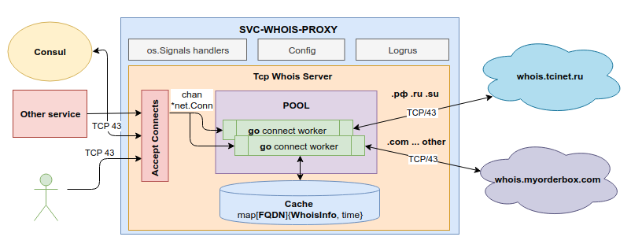

Whois-proxy server
=====================
Proxy whois cервер  (TCP/43)

SERVICE HOW TO?       
--------------------- 




По умолчанию внешние запросы идут на 43 порт соответсвующих внешних `whois` серверов. 

Особенности:

   * многопоточный (настраивается число go-рутин в пуле см. конфигурационный файл)
   * кеширования whois ответов на запросы (время кэша настраивается см. в конфигурационном файле)
   * мультиплексирования запросов данных доменов для разных доменных зон на разные whois сервера согласно заданной конфигурации
   * интерфейс взаимодействия стандартный текстовый протокол whois:
            
    whois -h localhost:43 example.com


PROJECT STRUCTURE
---------------------
 - .docker - папка с `dev` и `production` конфигами + dockerfile для приложения
 - .docs   - вспомогательная папка для документации, в данном случае содержит png изображение диаграммы проекта
 - cmd/whois-proxy/
      - main.go             - главная точка входа 
 - internal/ 
      - config    - nothing interesting only structs define's for yml parse
      - server    - tcp/udp server base
      - storage   - simple key value storage with mutex (go-routine safe)
      - whois     - Proxy Whois Server implementation (main logic pkg)  
 - .dockerignore                - docker ignore file 
 - .gitignore                   - git ignore
 - .gitmodules                  - git modules file
 - .gitlab-ci.yaml              - CI/CD gitlab
 - dev-down.sh                  - bash скрипт для остановки сервиса с помощью `docker-compose` 
 - dev-up.sh                    - bash скрипт для запуска сервиса в debug режиме помощью `docker-compose`
 - docker-compose.override.yml  - dev конфигурационный файл `для docker-compose`
 - go.mod                       - go modules requirements file
 - go.sum                       - go modules full-requirements file 
 - README.md                    - вы читаете этот файл :)  

SERVICE CONFIG
---------------------

Основной и единственный конфигурационный файл сервиса: `config.yaml`

```
graylog:
  host: graylog.host
  port: 12201
  platform: whois-proxy

  enableFileLog: true
  nameLogFile: ""
  disableColor: true
  debugLvl: false

service:
  host: 0.0.0.0
  port: 43
  maxCntConnect: 10

  maxLenBuffer: 4096
  readTimeout: 30
  writeTimeout: 30

  cacheTTL: 300
  cacheReset: 86400

  errorMsgTemplate: 'Bad request params'

  defaultWhois: 'whois.default.com:43'
    domainZoneWhois:
      ru: 'whois.tcinet.ru:43'
      xn--p1ai: 'whois.tcinet.ru:43'
      su: 'whois.tcinet.ru:43'

    addWhoisDescInfo:
      example.com:
      - 'descr:         some descr'


```

SERVICE CLI
---------------------

Not implemented

PROJECT BUILD
---------------------

1.Устанавливаем и настраиваем [Golang](https://golang.org/doc/install)

Требуемая версия `Go 1.12+` т.к. используется `go modules` подробнее читать [тут](https://github.com/golang/go/wiki/Modules)

1.1. Убедиться в корректной установке Go можно следущей командой:

Пример команды и ответа:
```   
    $go version
    
    go version go1.12 linux/amd64
```

1.2. Если собираем в директории под `$GOPATH` нужно включить поддержку go modules:
```
    export GO111MODULE=on
```     

2.Клонируем проект:
```
    git clone git@gitlab.esta.spb.ru:arseny/whois-proxy.git
```

3.Билд проекта

3.1. Заходим в папку проект:
```
    cd whois-proxy/cmd/whois-proxy
```
3.2. Компилируем (go module засимости подтянутся автоматически):
```
    go build
```
При успешной компиляции в текущей директории должен появиться бинарник: `whois-proxy`

4. Подкладываем config рядом с бинарником либо указываем через флаг `--config`

5.Запускаем сервиса: 
```
    ./whois-proxy
```

Сборка сервиса для DEV  
========================

1.Перейти в папку проекта 
```
    cd .../whois-proxy
```

2.Запустить скрипт сборки проекта:
```
    ./dev-up.sh debug
```

`debug` - собирает все с поддержкой отладчика `dlv` с помощью `docker-compose`

без `debug` - собирает все без отладчика


Прочие моменты
-------------------

Запуск go unit tests:
    
    ./dev-up.sh test

Как запустит сессию контейнера с отладчиком БЕЗ деплоера:

    docker exec -it whois-proxy_whois-proxy_1 ./dlv --headless --listen=:2345 --api-version=2 exec ./svc-whois-proxy

Если возникнут проблемы есть мануал от JetBrains [тут](https://blog.jetbrains.com/go/2018/04/30/debugging-containerized-go-applications/) 

